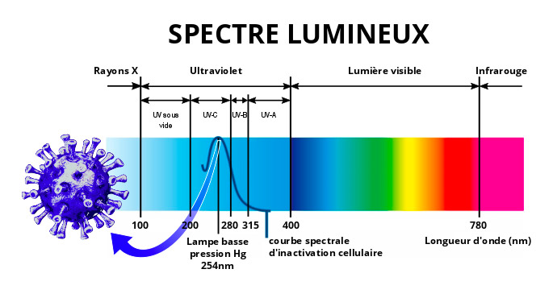
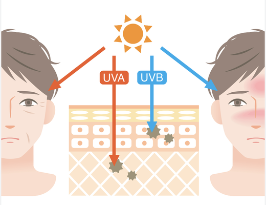

## Les Effets du Soleil sur la Peau : Un Savoir Essentiel pour Prendre Soin de Soi

Hier, lors d'une sortie avec mes proches, j'ai reçu des compliments sur ma peau. Cela m'a donné envie de partager quelques connaissances sur les soins de la peau, qui pourraient intéresser de nombreuses personnes, qu'elles soient déjà informées ou non.

### L'Ennemi de la Peau : Les Rayons du Soleil

Un des plus grands ennemis du vieillissement et des dommages cutanés est sans conteste le soleil. Les rayons solaires contiennent plusieurs types de longueurs d'onde, mais les plus préoccupants sont les rayons UVB et UVA.

#### Les Rayons UVB

Les rayons UVB atteignent principalement la couche basale de la peau, où la mélanine est produite. Cette mélanine a pour rôle de protéger notre peau des effets nocifs du soleil, en créant une barrière naturelle. De plus, les rayons UVB sont essentiels pour la synthèse de la vitamine D, un nutriment crucial pour notre santé. Ces rayons sont les plus intenses entre 9h et 15h.

#### Les Rayons UVA

Les rayons UVA, quant à eux, ont une longueur d'onde plus longue et peuvent causer des dommages oxydatifs jusqu'au niveau de l'ADN. Ils sont responsables des mutations cellulaires qui peuvent conduire au cancer de la peau. Ces rayons sont présents dès le matin avant 9h et après 16h. Une astuce simple pour les repérer : si votre ombre est plus longue que vous, les UVA sont probablement à l'œuvre.

### Précautions à Prendre

Il est donc essentiel de réfléchir à nos habitudes d'exposition au soleil. Les recommandations concernant l'exposition au soleil pour la synthèse de la vitamine D ne sont pas toujours à jour. Par exemple, il est conseillé de ne pas exposer les enfants de moins d'un an au soleil direct.

Pour notre peau, l'application d'une crème solaire est primordiale. Plus tôt vous commencez à en appliquer, mieux c'est. Même à l'intérieur, n'oubliez pas que les rayons UVA peuvent traverser les fenêtres.

### Une Approche Holistique

Enfin, en plus des soins externes, il est crucial de nourrir notre peau de l'intérieur. Une alimentation équilibrée et riche en nutriments contribue à une peau saine et éclatante.

Prenez soin de votre peau, car elle mérite toute notre attention et protection. 🌞

