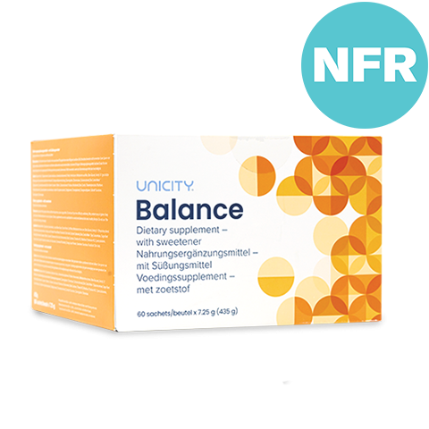

# Balance



### **Description du Produit**

**Unicity Balance** est un complément alimentaire conçu pour soutenir la santé métabolique en régulant les niveaux de cholestérol, de glucose et en favorisant une digestion saine. Ce produit utilise une combinaison unique de fibres, de phytostérols, et d'autres ingrédients naturels pour offrir des bienfaits multiples.

### **Ingrédients et Bienfaits**

| **Ingrédients**             | **Bienfaits**                                                          |
| --------------------------- | ---------------------------------------------------------------------- |
| **Biosphere Fiber MC**      | Atténue l'appétit, modère le niveau de glucose, favorise la digestion. |
| **Unicity 7X MC**           | Réduit l'appétit, augmente le métabolisme.                             |
| **Bios Cardio Matrix MC**   | Améliore le profil lipidique, soutient la perte de poids.              |
| **Phytostérols**            | Réduit l'absorption du cholestérol alimentaire.                        |
| **Policosanol**             | Contribue à la diminution du mauvais cholestérol (LDL).                |
| **Bios Vitamin Complex MC** | Apporte un soutien antioxydant et énergétique.                         |

### **Recommandations d'Utilisation**

- **Dosage** : Mélanger un sachet avec 250 à 300 ml d'eau.
- **Moment de Consommation** : Consommer 10 à 15 minutes avant les repas principaux.
- **Conseils** : Adopter un régime alimentaire équilibré et un mode de vie sain pour maximiser les bienfaits du produit.

### **Avantages**

- **Régulation du Cholestérol** : Réduit le LDL (mauvais cholestérol) et augmente le HDL (bon cholestérol).
- **Gestion de la Glycémie** : Aide à réguler les pics de glycémie.
- **Soutien Digestif** : Favorise une digestion saine et soutient la sensation de satiété.
- **Perte de Poids** : Contribue à la perte de poids en modérant l'appétit et en augmentant le métabolisme.

### **Études Cliniques**

Des études cliniques ont démontré l'efficacité d'Unicity Balance dans la réduction des niveaux de cholestérol total, de LDL et de triglycérides, ainsi que dans la gestion des niveaux de glucose sanguin. Ces études confirment également son rôle dans la perte de poids et le soutien d'une digestion saine.

### **Précautions**

- **Effets Secondaires** : Certains utilisateurs peuvent éprouver des effets gastro-intestinaux tels que des ballonnements ou des gaz au début de la prise.
- **Consultation Médicale** : Toujours consulter un professionnel de santé avant de débuter une nouvelle supplémentation, surtout en cas de conditions médicales préexistantes ou de prise de médicaments.

### **Tableau des Valeurs Nutritives**

| **Nutriment**            | **Quantité par Portion** | **% Valeurs Quotidiennes** |
|--------------------------|--------------------------|----------------------------|
| Calories                 | 15                       |                            |
| Total des Glucides       | 5 g                      | 2%                         |
| Fibres Alimentaires      | 3 g                      | 16%                        |
| Fibres Solubles          | 3 g                      |                            |
| Vitamine A               | 104 mcg RAE              | 10%                        |
| Vitamine C               | 45 mg                    | 50%                        |
| Vitamine E               | 30 mg a-TE               | 200%                       |
| Thiamine (Vitamine B1)   | 2 mg                     | 170%                       |
| Riboflavine (Vitamine B2)| 2 mg                     | 150%                       |
| Niacine (Vitamine B3)    | 26 mg                    | 160%                       |
| Vitamine B6              | 7 mg                     | 410%                       |
| Folate                   | 367 mcg DFE              | 90%                        |
| Vitamine B12             | 25 mcg                   | 1040%                      |
| Biotine                  | 20 mcg                   | 70%                        |
| Calcium                  | 60 mg                    | 4%                         |
| Zinc                     | 2.3 mg                   | 20%                        |
| Chrome                   | 100 mcg                  | 290%                       |

### **La Science dernière "Balance"**



### **Conclusion**

Unicity Balance est un complément alimentaire complet et efficace pour ceux qui cherchent à améliorer leur santé métabolique, gérer leur cholestérol et leur glycémie, et soutenir leur digestion. Avec une combinaison d'ingrédients naturels et de fibres brevetées, il offre une solution holistique pour le bien-être général.

Pour plus d'informations sur les recherches scientifiques derrière les produits Unicity, visitez unicityscience.org.

---

**Note**: Les informations fournies dans cette fiche produit sont basées sur des sources fiables et des études cliniques. Toutefois, il est toujours recommandé de consulter un professionnel de santé avant de commencer tout nouveau complément alimentaire.

